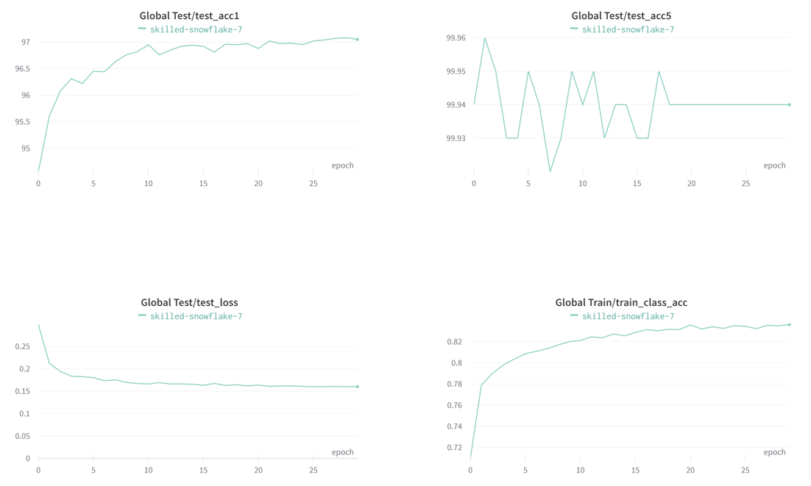

# [A ConvNet for the 2020s](https://arxiv.org/abs/2201.03545)

--- 

<p align="center">

</p>

* More details about this repo please check [```ORIGINAL_README.md```](ORIGINAL_README.md)

## Fine-tuning
* Specify ```finetune```: local path or remote official url
* Specify ```data_set```: 'CIFAR', 'IMNET' or 'image_folder'.
    Set 'CIFAR' to download from torchvision, 'IMGET' for ImageNet, and 'image_folder' for customized dataset.
* Specify ```data_path``` and ```nb_classes```: if ```data_set``` is 'image_folder'
```bash
python -m torch.distributed.launch --nproc_per_node=8 main.py \
--model 'convnext_base' --drop_path 0.2 --input_size 224 \
--batch_size 16 --lr 5e-5 --update_freq 2 \
--warmup_epochs 0 --epochs 30 --weight_decay 1e-8  \
--layer_decay 0.8 --head_init_scale 0.001 --cutmix 0 --mixup 0 \
--finetune './weights/convnext_base_22k_224.pth' \
--data_path '/home/brian/datasets/CIFAR-10-images/train' \
--eval_data_path '/home/brian/datasets/CIFAR-10-images/test' \
--nb_classes 10 --data_set 'image_folder' --output_dir './output' \
--log_dir './logs' --enable_wandb true --wandb_ckpt true
```

## Results
Follow the official pre-trianed recipe, results on CIFAR-10:
<p align="center">

</p>

## Acknowledgement
- This implemenation is adapted from the [officical implementation](https://github.com/facebookresearch/ConvNeXt), with a slight specification.