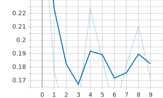
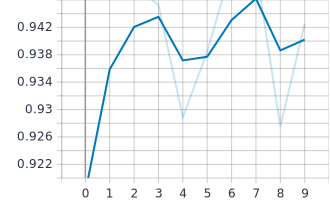

# Swim-Transformer for image classification
Swim-Transformer can serve as a backbone from most of CV tasks. Swim-Transformer and it's variants have dominate lot's of tasks. (2022/3/8)
- Here is a image classification implementation.
- To scale to other tasks, simply adapt the ```head``` from classification to others, such as segmentation.
- More over, Swim-Transformer can act as the backbone, replacing CNNs, in structural models.

## Notes and insights
To be update.


## Usage
### Dataset
Flower classification dataset

### Pre-train
In the original paper, the models are pre-trained in ImageNet-1K or ImageNet-22K, which are both natural image datasets. \
To obtain great performance on specific domain tasks, such as medical images tranformation, 
models may be required to pre-train from scratch with relative huge datasets.

### Fine-tune
Excute the ```train.py``` with scripts below to fine-tune with pre-trained weights.
* Run on single GPU. Specify with ```device``` setting.
* Change **```from model import swin_tiny_patch4_window7_224 as create_model```** to switch model.
```bash
python train.py --num_classes 5 \
    --epochs 10 --batch-size 8 --lr 1e-4 \
    --data-path '/home/brian/datasets/flower_data/flower_photos' \
    --weights './weights/swin_tiny_patch4_window7_224.pth' \
    --device 'cuda:0'
```
* Results:
<p align="center">
> validation loss

> validation accuracy

</p>

### Predict
Excute the ```predict.py``` to predict a single pic with the fine-tuned weights abtained above.
* Specify the ```img_path``` value in main function.
* Specify the ```model_weight_path``` value toward fine-tuned weights.
```
python predict.py
```
* Results:
class: daisy        prob: 2.15e-05
class: dandelion    prob: 1.93e-05
class: roses        prob: 0.000206
class: sunflowers   prob: 4.97e-06
class: tulips       prob: 1.0


## Acknowledgement
- This implementation is heavily borrowed from [swim_transformer](https://github.com/WZMIAOMIAO/deep-learning-for-image-processing/tree/master/pytorch_classification/swin_transformer), Wu Zhe and [offical repo](https://github.com/microsoft/Swin-Transformer), Microsoft.
- Especially thank Wu Zhe for his [detialled video lesson](https://www.bilibili.com/video/BV1yg411K7Yc) and [Blog](https://blog.csdn.net/qq_37541097/article/details/121119988), which are exactly helpful. Also thank Bryany Zhu for his [intensive reading video](https://www.bilibili.com/video/BV13L4y1475U),
which spark some great insights to me.
