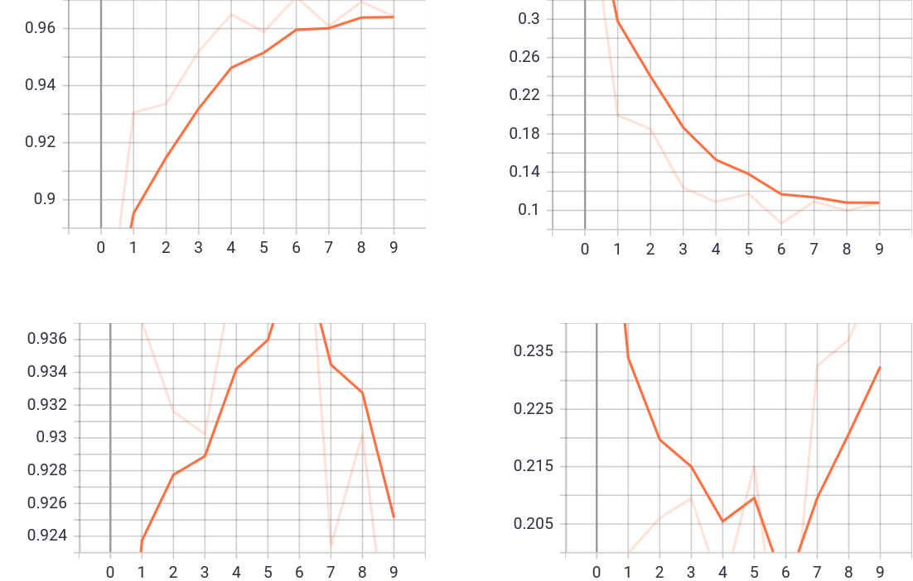

# gMLP for image classification in CV
* Paper: [Pay Attention to MLPs](https://arxiv.org/abs/2105.08050), Google Research, Brain Team, June, 2021.
**Attention: This implementation can load the official pre-trained weights, both share the same namespace.**
> Note: The official pre-trained weights refer to the [```timm``` library](https://github.com/rwightman/pytorch-image-models) release.

## Usage
### Dataset
[Flower classification dataset](http://download.tensorflow.org/example_images/flower_photos.tgz)

### Pre-train
In the original paper, the models are pre-trained in ImageNet-1K or ImageNet-21K, which are both natural image datasets.

### Fine-tune
Excute the ```main_finetune.py``` with scripts below to fine-tune with pre-trained weights.
* Run on single GPU. Specify with ```device``` setting.
* Change **```from gmlp import gmlp_s16_224 as gmlp```** to switch model.
```bash
python main_finetune.py --num_classes 5 \
    --epochs 10 --batch-size 16 --lr 1e-4 \
    --data-path '/home/brian/datasets/flower_data/flower_photos' \
    --pretrained --device 'cuda:0'
```

* Results

> From top-left to bottom-right: train acc, loss and val acc, loss
<p align="center">

</p>

## Reference
- [```timm``` library](https://github.com/rwightman/pytorch-image-models), Ross Wightman.
- [mlp-mixer-pytorch](https://github.com/lucidrains/mlp-mixer-pytorch), lucidrains.
- [External-Attention-pytorch](https://github.com/xmu-xiaoma666/External-Attention-pytorch), xiaoma.